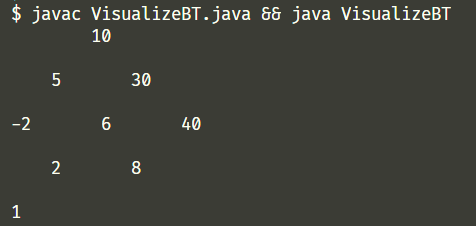

# ADI

> Advanced Data Structures in JAVA. Questions done in classroom.

## Linked List

- [LRU cache (Interview Bit)](./ADI/LRUCache.java)

## Binary Tree

- [Convert Binary search tree to doubly linked list(Singly LL applied)](./ADI/BSTtoLL.java)
- [Calculate difference of sum of even and sum of odd nodes](./ADI/OddEvenNodes.java)
- [Find the rank of a key in Balanced Search Tree](./ADI/RankInBST.java)
- [Sum root to leaf numbers (Interview Bit)](./ADI/SumRootToLeaf.java)
- [All possible paths from root to leaves (Interview Bit)](./ADI/RootToLeaves.java)
- [All possible paths from root to leaves with given sum (Interview Bit)(**_ArrayList Solution_**)](./ADI/RootToLeavesWithSum.java)
- [Flatten Binary Tree to Linked List (Interview Bit)](./ADI/FlattenBTtoLL.java)
- [Zig Zag Traversal (Interview Bit)](./ADI/ZigZagTraversal.java)
- [Next Right Pointer (Interview Bit)](./ADI/NextRightPointer.java)

## Heap

- [Median of a running array](./ADI/MedianRunArray.java)
- [**_Trie tree_** Hotel Review (Interview Bit)](./ADI/Trie.java)
- [Merge K sorted Linked List (Interview Bit)](./ADI/MergeKSortedLL.java)
- [N max pair combinations](./ADI/MaxPairComb.java)

## Hash

- [Two sum (Interview Bit)](./ADI/TwoSum.java)

## Graph

- [Leaves of a subtree (DFS)](./ADI/LeavesOfSubtree.java)

## Others

- [Visualizing a binary tree (Not perfect works for almost all cases, currently under development)](./ADI/VisualizeBT.java)
